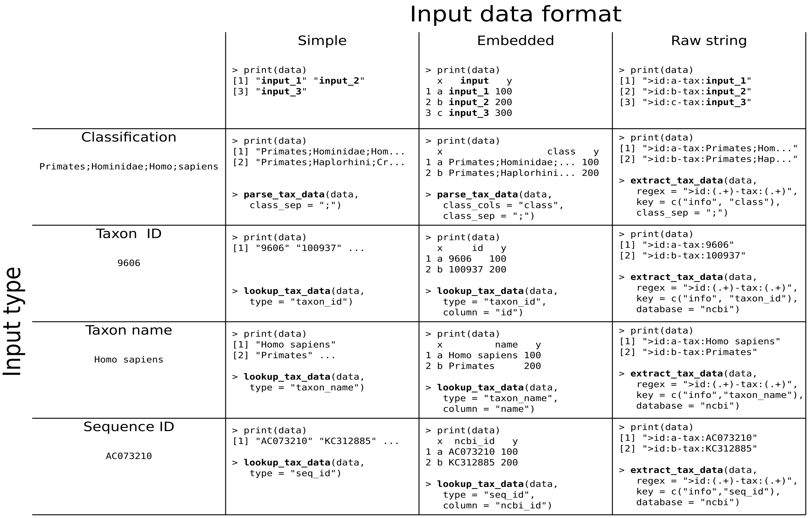
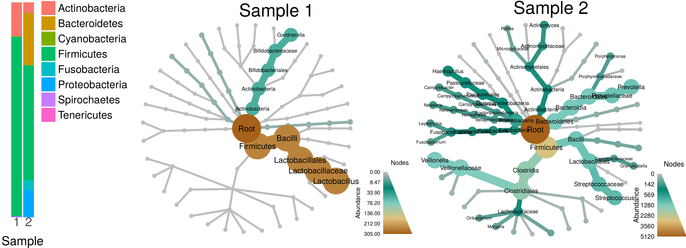

```{r setup, include=FALSE}
knitr::opts_chunk$set(cache = TRUE, autodep = TRUE, mysize = TRUE, size = '\\small', warning = FALSE)
knitr::knit_hooks$set(mysize = function(before, options, envir) {
  if (before) 
    return(options$size)
})
options(width = 90)
library(metacoder)
```

## Parsing, manipulating, and visualizing taxonomic data in R

### Motivation:

* High-throughput sequencing of environmental DNA has led to large taxonomic data sets
* The hierarchical nature of taxonomic classifications make manipulating them and associated data difficult

### The `taxa` package:

* Flexible reading of most sources of taxonomic information
* `dplyr`-inspired filtering and subsetting of taxa and associated information
* A standard set of classes for taxonomic data

### The `metacoder` package:

* Simple reading of specific file formats commonly used in metabarcoding
* Flexible, information-rich plotting of taxonomic data
* Functions for analyzing community taxonomic diversity

## Parsing taxonomic data

Most sources of taxonomic data in most formats can be parsed.



## Parsing taxonomic data: Embedded classifications

```{r, echo = FALSE}
rdp_fasta_url <- "https://mothur.org/w/images/b/b5/Trainset10_082014.rdp.tgz"
temp_dir_path <- tempdir()
local_file_path <- file.path(temp_dir_path, basename(rdp_fasta_url))
download.file(url = rdp_fasta_url, destfile = local_file_path, quiet = TRUE, mode="wb")
# Get contents of tar archive
unpacked_file_paths <- untar(local_file_path, list = TRUE)
# Uncompress archive
untar(local_file_path, exdir = temp_dir_path)
# Identify the Mothur RDP training set
input_file_path <- file.path(temp_dir_path, unpacked_file_paths[grepl("fasta$", unpacked_file_paths)])
seqs <- ape::read.FASTA(input_file_path)
```

Embedded classifications often appear in abundance matrices and FASTA headers and are the best source of taxonomic information.

Any extra observation info that should be preserved in the parsed data can be added to the `key` option as `"info"`.

The code below parses the Mothur 16s RDP training set.

```{r eval = FALSE}
library(taxa)

seqs <- ape::read.FASTA("trainset14_032015.rdp.fasta") 
```

```{r, warning = FALSE, message = FALSE}
cat(names(seqs)[1]) 
```

```{r, warning = FALSE, message = FALSE}
data <- extract_tax_data(names(seqs)[1:1000],
                         regex = "(.*)\\t(.*)", 
                         key = c(rdp_id = "info", my_class = "class"),
                         class_sep = ";")
```


## Parsing taxonomic data: Embedded classifications

```{r}
print(data)
```


## Parsing taxonomic data: Genbank accession numbers

GenBank accession numbers can be used to look up the NCBI taxonomy for sequences. 

However, this can be quite slow since this information must be queried from NCBI's servers, which are heavily used.

```{r, warning = FALSE, message = TRUE, eval = TRUE}
ids <- c("JQ086376.1", "AM946981.2", "JQ182735.1", "CP001396.1", "J02459.1",
         "AC150248.3", "X64334.1", "CP001509.3", "CP006698.1", "AC198536.1")
contaminants <- lookup_tax_data(ids, type = "seq_id")
print(contaminants)
```

## Parsing taxonomic data: Taxon names

Taxon names can also be used to look up complete classifications.

Which taxon names are valid depends on the database used. 

```{r}
taxon_names <- c("Acrobolbaceae", "Adelanthaceae", "Allisoniaceae", "Amblystegiaceae", 
                 "Andreaeaceae", "Andreaeobryaceae", "Aneuraceae", "Antheliaceae")
```

Note that a different database is being used this time: The Integrated Taxonomic Information System.

```{r, warning = FALSE, message = FALSE, eval = TRUE}
bryophytes <- lookup_tax_data(taxon_names, type = "taxon_name", database = "itis")
print(bryophytes)
```

## Plotting taxonomic data with metacoder

`metacoder` uses the classes defined by `taxa` to plot taxonomic information.




## Plotting taxonomic data with metacoder

Parsed data can be plotted using the `heat_tree` function.

Any statistic can be mapped to the size and color of nodes and edges.

```{r fig.width = 2.4}
library(metacoder)
heat_tree(data, node_size = n_obs, node_label = taxon_names, node_color = n_obs)
```


## Plotting taxonomic data: Overlap optimization

The size range of nodes is optimized for each graph by default to avoid overlaps while maximizing size range.

The balance between the two goals can be modified with the `overlap_avoidance` option.

```{r, eval=FALSE}
heat_tree(data, node_size = n_obs, overlap_avoidance = 10, title = "10")

heat_tree(data, node_size = n_obs, overlap_avoidance = 0.1, title = "0.1")
```


```{r, echo=FALSE, fig.width = 3.5}
gridExtra::grid.arrange(ncol = 2, nrow = 1, widths = c(1, 1.1),
                        heat_tree(data, node_size = n_obs, overlap_avoidance = 10, title = "10"),
                        heat_tree(data, node_size = n_obs, overlap_avoidance = 0.1, title = "0.1"))
```


## Plotting taxonomic data: Size

The size range of nodes and edges can also be specified manually.

```{r eval = FALSE}
heat_tree(data, node_size = - n_supertaxa, node_size_range = c(0.001, 0.03),
          edge_size_range = c(0.001, 0.001))

heat_tree(data, edge_size = - n_supertaxa, edge_size_range = c(0.0001, 0.01),
          node_size_range = c(0.005, 0.005))
```

```{r echo = FALSE}
gridExtra::grid.arrange(ncol = 2, nrow = 1, widths = c(1.1, 1),
                        heat_tree(data, node_size = - n_supertaxa, node_size_range = c(0.001, 0.03),
                                  edge_size_range = c(0.001, 0.001)),
                        heat_tree(data, edge_size = - n_supertaxa, edge_size_range = c(0.0001, 0.01),
                                  node_size_range = c(0.005, 0.005)))
```


## Plotting taxonomic data: Color

Mapping statistics to color works like it does for size.

A custom color range can be specified with `node_color_range` and `edge_color_range`.

```{r eval = FALSE}
heat_tree(data, node_size = n_obs, node_color = n_obs,
          node_color_range = c("#FFFFFF", "darkorange3", "#4e567d"))

heat_tree(data, node_size = n_obs, node_color = "grey",
          edge_color = n_obs)
```


```{r echo= FALSE, fig.width = 3.5}
gridExtra::grid.arrange(ncol = 2, nrow = 1,
                        heat_tree(data, node_size = n_obs, node_color = n_obs,
                                  node_color_range = c("#FFFFFF", "darkorange3", "#4e567d")),
                        heat_tree(data, node_size = n_obs, node_color = "grey",
                                  edge_color = n_obs))
```


## Plotting taxonomic data: Labels

Labels can be added to nodes and edges.

Unlike most graphing in R, label sizes relative to other graph elements do not change with output size or aspect ratio.

```{r eval = FALSE}
heat_tree(data, node_size = n_obs, node_label = taxon_names,
          node_label_max = 200, title = "Node labels")

heat_tree(data, node_size = n_obs, edge_label = taxon_names,
          edge_label_max = 200, title = "Edge labels")
```


```{r echo = FALSE, fig.width = 3.2}
gridExtra::grid.arrange(ncol = 2, nrow = 1,
                        heat_tree(data, node_size = n_obs, node_label = taxon_names,
                                  node_label_max = 200, title = "Node labels"),
                        heat_tree(data, node_size = n_obs, edge_label = taxon_names,
                                  edge_label_max = 200, title = "Edge labels"))
```


## Plotting taxonomic data: Layouts

Different layouts are available that suit different data structures.

For stochastic, simulated layouts like "davidson-harel", it can sometimes be useful to initialize with another layout.

```{r eval = FALSE}
set.seed(2)
heat_tree(data, node_size = n_obs, node_label = taxon_names,
          layout = "davidson-harel")

heat_tree(data, node_size = n_obs, node_label = taxon_names,
          layout = "davidson-harel", initial_layout = "reingold")
```


```{r echo = FALSE, fig.width = 3.2}
set.seed(2)
gridExtra::grid.arrange(ncol = 2, nrow = 1,
                        heat_tree(data, node_size = n_obs, node_label = taxon_names,
                                  layout = "davidson-harel"),
                        heat_tree(data, node_size = n_obs, node_label = taxon_names,
                                  layout = "davidson-harel", initial_layout = "reingold"))
```


## Subsetting taxonomic data

Modifying data is done using functions analogous to `dplyr`'s functions for data frames.

Filtering taxa can be done using `filter_taxa` with one or more filtering conditions. 

The code below filters out all taxa with less than 3 observations.

```{r eval = FALSE}
data %>%
  heat_tree(node_size = n_obs, node_label = taxon_names, node_color = n_obs)

filter_taxa(data, n_obs >= 3) %>%
  heat_tree(node_size = n_obs, node_label = taxon_names, node_color = n_obs)
```

```{r echo = FALSE, fig.width = 3.2}
set.seed(1)
gridExtra::grid.arrange(ncol = 2, nrow = 1,
                        heat_tree(data,
                                  node_size = n_obs, node_label = taxon_names,
                                  node_color = n_obs),
                        heat_tree(filter_taxa(data, n_obs >= 3),
                                  node_size = n_obs, node_label = taxon_names,
                                  node_color = n_obs))
```


## Subsetting taxonomic data: Including subtaxa

The subtaxa of taxa passing the filter can be included as well using the `subtaxa` option.

The code below subsets the data for "Firmicutes" and "Bacilli" and their subtaxa.

```{r eval = FALSE}
filter_taxa(data, taxon_names == "Firmicutes", subtaxa = TRUE) %>%
  heat_tree(node_size = n_obs, node_label = taxon_names, node_color = n_obs)

filter_taxa(data, taxon_names == "Bacilli", subtaxa = TRUE) %>%
  heat_tree(node_size = n_obs, node_label = taxon_names, node_color = n_obs)
```

```{r echo = FALSE}
gridExtra::grid.arrange(ncol = 2, nrow = 1,
                        heat_tree(filter_taxa(data, taxon_names == "Firmicutes", subtaxa = TRUE),
                                  node_size = n_obs, node_label = taxon_names,
                                  node_color = n_obs),
                        heat_tree(filter_taxa(data, taxon_names == "Bacilli", subtaxa = TRUE),
                                  node_size = n_obs, node_label = taxon_names,
                                  node_color = n_obs))
```


## Subsetting taxonomic data: Including supertaxa

The `supertaxa` option works similar to the `subtaxa` option. 

The code below does the same subset as last slide, but includes the supertaxa as well. 

```{r eval = FALSE}
filter_taxa(data, taxon_names == "Firmicutes", subtaxa = TRUE, supertaxa = TRUE) %>%
  heat_tree(node_size = n_obs, node_label = taxon_names, node_color = n_obs)

filter_taxa(data, taxon_names == "Bacilli", subtaxa = TRUE, supertaxa = TRUE) %>%
  heat_tree(node_size = n_obs, node_label = taxon_names, node_color = n_obs)
```


```{r echo = FALSE}
gridExtra::grid.arrange(ncol = 2, nrow = 1,
                        heat_tree(filter_taxa(data, taxon_names == "Firmicutes", subtaxa = TRUE, supertaxa = TRUE),
                                  node_size = n_obs, node_label = taxon_names,
                                  node_color = n_obs),
                        heat_tree(filter_taxa(data, taxon_names == "Bacilli", subtaxa = TRUE, supertaxa = TRUE),
                                  node_size = n_obs, node_label = taxon_names,
                                  node_color = n_obs))
```

## Subsetting taxonomic data: Removing internal taxa 

By default, when internal taxa are removed their subtaxa are reassigned to any supertaxon that passed the filter.

Not doing this is possible with the `reassign_taxa` option, but usually makes a mess. 

The code below removes the taxa in red with and without reassigning taxa. 

```{r eval = FALSE}
data %>%
  heat_tree(node_size = n_obs, node_label = taxon_names, 
            node_color = ifelse(n_supertaxa == 2, "red", "grey"), make_legend = FALSE)

filter_taxa(data, n_supertaxa != 2) %>%
  heat_tree(node_size = n_obs, node_label = taxon_names, node_color = n_obs)

filter_taxa(data, n_supertaxa != 2, reassign_taxa = FALSE) %>%
  heat_tree(node_size = n_obs, node_label = taxon_names, node_color = n_obs,
            tree_label = taxon_names)
```


```{r echo = FALSE}
set.seed(2)
gridExtra::grid.arrange(ncol = 3, nrow = 1, widths = c(.8, 1, 1.1),
                        heat_tree(data,
                                  node_size = n_obs, node_label = taxon_names,
                                  node_color = ifelse(n_supertaxa == 2, "red", "grey"), make_legend = FALSE),
                        heat_tree(filter_taxa(data, n_supertaxa != 2),
                                  node_size = n_obs, node_label = taxon_names,
                                  node_color = n_obs),
                        heat_tree(filter_taxa(data, n_supertaxa != 2, reassign_taxa = FALSE),
                                  node_size = n_obs, node_label = taxon_names,
                                  node_color = n_obs, tree_label = taxon_names))
```


## Sampling taxa

Random sampling of taxa works in a similar way to filtering taxa. 

All of the options for `filter_taxa`, such as `subtaxa` and `reassign_taxa`, are available to `sample_n_taxa`. 

```{r, eval=FALSE}
set.seed(1)

sample_n_taxa(data, 20, supertaxa = TRUE) %>%
  heat_tree(node_size = n_obs, node_label = taxon_names, node_color = n_obs)

sample_n_taxa(data, 40, supertaxa = TRUE) %>%
  heat_tree(node_size = n_obs, node_label = taxon_names, node_color = n_obs)
```


```{r echo = FALSE, fig.width = 3}
set.seed(1)
gridExtra::grid.arrange(ncol = 2, nrow = 1,
                        heat_tree(sample_n_taxa(data, 20, supertaxa = TRUE),
                                  node_size = n_obs, node_label = taxon_names,
                                  node_color = n_obs),
                        heat_tree(sample_n_taxa(data, 40, supertaxa = TRUE),
                                  node_size = n_obs, node_label = taxon_names,
                                  node_color = n_obs))
```

## Sampling observations

Observations assigned to taxa can also be filtered and sampled. 

The code below randomly selects 50 (without replacement) and 100,000 (with replacement) observations. 

```{r, eval=FALSE}
sample_n_obs(data, "tax_data", 50) %>%
  heat_tree(node_size = n_obs, node_label = taxon_names, node_color = n_obs)

sample_n_obs(data, "tax_data", 100000, replace = TRUE) %>%
  heat_tree(node_size = n_obs, node_label = taxon_names, node_color = n_obs)
```

```{r echo = FALSE, fig.width = 3}
set.seed(1)
gridExtra::grid.arrange(ncol = 2, nrow = 1,
                        heat_tree(sample_n_obs(data, "tax_data", 50), node_size = n_obs, node_label = taxon_names, node_color = n_obs),
                        heat_tree(sample_n_obs(data, "tax_data", 100000, replace = TRUE), node_size = n_obs, node_label = taxon_names, node_color = n_obs))
```

## Example Application: The Human Microbiome project

Pairwise comparisons of microbiome composition in different parts of the human body.
Only significant differences in abundance are colored. 


