```{r setup, include=FALSE}
library(knitr)
opts_chunk$set(echo = FALSE)
```


\section{Background}

### Traditional quantitative ecology

* Historically, most community ecology involved counting and identifying organisms in the field.
* The number, mass, or area of organisms was recorded by hand and organisms were identified by experts.
* In many cases, the entire community in a given sample was known, unlike current molecular methods.
* Many analysis techniques used today for molecular methods were created for this type of data.

```{r, out.height= "100px", fig.cap="Whittaker 1960"}
sharedbib::add_document('whittaker1960vegetation')
knitr::include_graphics("images/whitakker.png")
```

### Barcoding

* Barcoding is using PCR amplification of a gene sequence to identify a single organism.
* This allows non-experts to identify organisms accurately.
* Only a small piece of the organism is needed.
* Reference databases of curated sequences are needed.
* Common barcodes include ITS for fungi, rbcL in plants, and 16S for prokaryotes.

```{r, out.height= "100px", fig.cap="Bodilis et al 2012"}
sharedbib::add_document('bodilis2012variable')
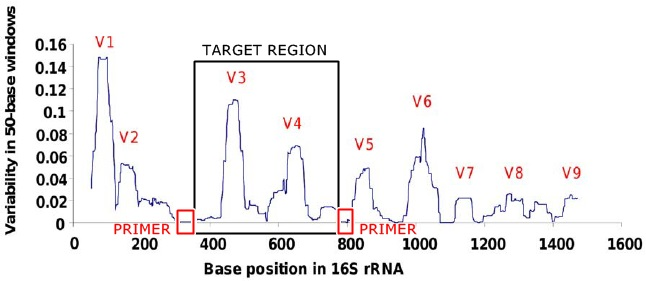
```

### "Shotgun" metagenomics

"Shotgun" metagenomics (or just metagenomics) data is created in a similar way to genomic data, except DNA is extracted from an unknown mixture of organisms.

```{r, out.height= "170px"}
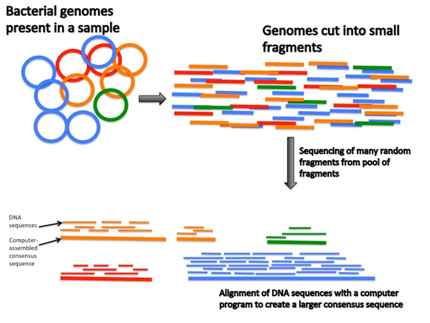
```

### Background: Metabarcoding

* Metabarcoding is a PCR-based method of inferring community composition from a DNA extract
* A gene common to the organisms targeted is amplified by PCR
* The PCR product is sequenced and compared to reference databases
* Each sample gets the same number of reads (ideally)

```{r, out.height= "130px"}
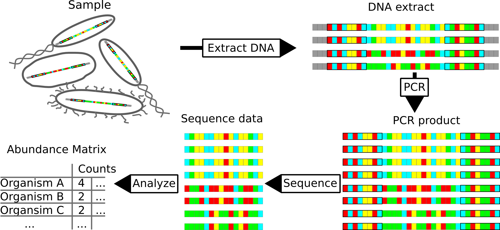
```


### .

\section{Metabarcoding}

General outline of how metabarcoding data is generated

### Metabarcoding analysis outline

1. Extract DNA from samples
2. Amplify a given gene with PCR for each sample
3. Sequence PCR products of each sample with Illumina
4. Remove primer sequences and quality filter
5. Merge paired-end reads if applicable
6. Make groups of similar sequences
7. Assign taxonomy to each group
8. Make an "abundance matrix" of counts of reads in each group in each sample
9. Conduct project-specific analysis on abundance matrix

### Software for creating abundance matrices

* **dada2**: An R package. Fast and statistically-sound. This is the newest of the tools listed here.
* **Mothur**: Command-line tools set. Has some additional diversity analyses.
* **USEARCH/VSEARCH**: Command-line tool set. Generally faster than mothur.
* **QIIME**: Large python-based analysis pipeline. Combines other tools, including dada2 and VSEARCH. Has plugins for specific analyses.

All of these are free and open source!

### How similar sequences are grouped

The raw data of metabarcoding is millions of short reads the must be grouped into something analogous to "species" in traditional community ecology. They can be grouped in the following ways:

* Unique sequences: Every unique sequence is treated as a different "species"
* Amplicon Sequence Variants (**ASVs**): Error-corrected unique sequences
* Operation Taxonomic Units (**OTUs**): Sequences clustered into "species-level" units
* Taxa: Sequences assigned to taxa in a reference database

### Abundance vs counts

* Read counts are often interpreted as a measure of abundance, but of what?
* Individuals? Cells? Mass? DNA? Genes? 
* If the process was unbiased, read counts would correlate with number of gene copies amplified. However...

### Counts are biased

* DNA from dead organisms
* Copy number variation
* DNA extraction bias
* PCR bias
* Sequencing bias

```{r, out.height= "100px", fig.cap="McLaren et al 2019"}
sharedbib::add_document('mclaren2019consistent')
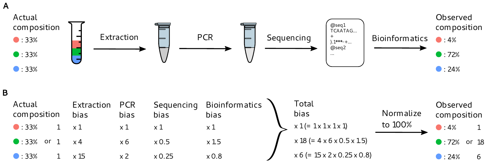
```

### Accounting for unequal reads per sample

* The total number of reads per sample are the same (ideally).
* For a few specific applications, untransformed counts are used.
* However, usually a correction for unequal sample read count is made, such as:
   + Proportions
   + "Rarefied" counts
   + Presence/Absence

**What kind of normalization done (if any) depends on the analysis, especially if statistics are used.**

```{r, out.height= "80px", fig.cap="McMurdie et al 2014"}
sharedbib::add_document('mcmurdie2014waste')
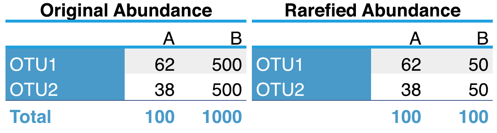
```


### .

\section{Abundance}

Bioinformatic analysis techniques for exploring abundance


### How abundance data is stored

* Abundance data is usually stored in a sample by OTU/ASV/Taxon matrix.
* Samples might be rows or columns, depending on software and style.
* Another table is used to store per-sample data.
* The sample IDs in the sample data table should match the columns/row names in the abundance matrix.

```{r, out.height = "50px"}
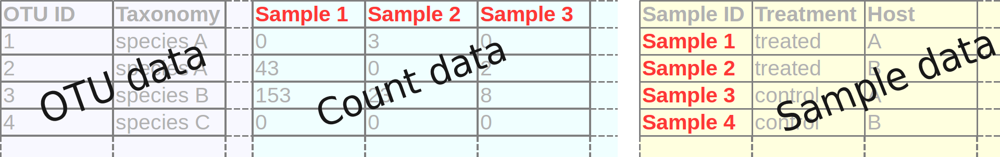
```


### How abundance is plotted

* Abundance data is often plotted using pie charts or stacked bar charts.
* These are often of limited usefulness due to the reliance on color to differentiate taxa.
* Some plotting methods incorporate taxonomic hierarchy, including:
  * heat trees
  * "sunburst" plots
  * nested circles

```{r, out.width= "300px", fig.cap="Wagner et al 2016"}
sharedbib::add_document('wagner2016host')
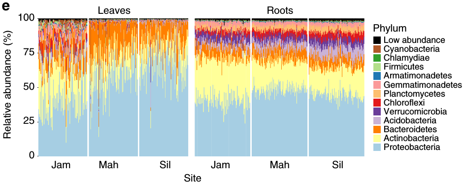
```

### Good stacked barchart example

```{r, out.width= "300px", fig.cap="Adam et al 2018"}
sharedbib::add_document('adam2018cucurbita')
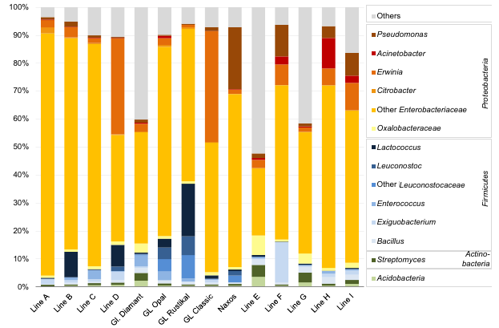
```

### Problematic stacked barchart example

```{r, out.height= "200px"}
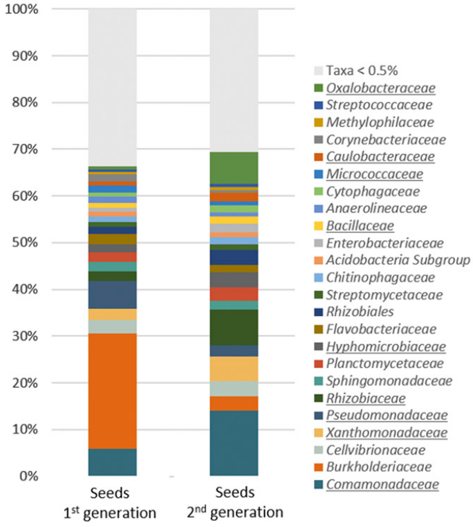
```

### Problematic stacked barchart example

```{r, out.width= "300px"}
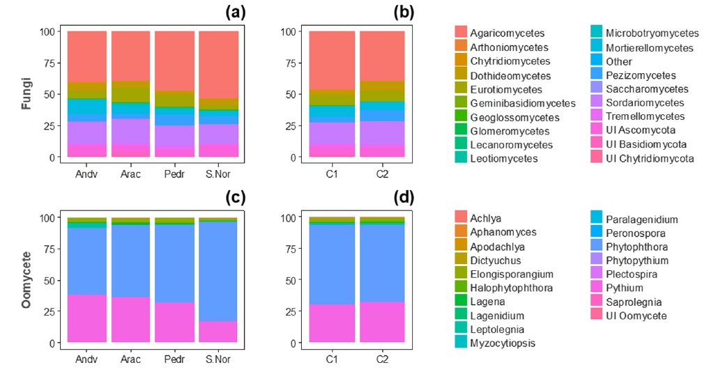
```

### Problematic pie chart example

```{r, out.width= "300px"}
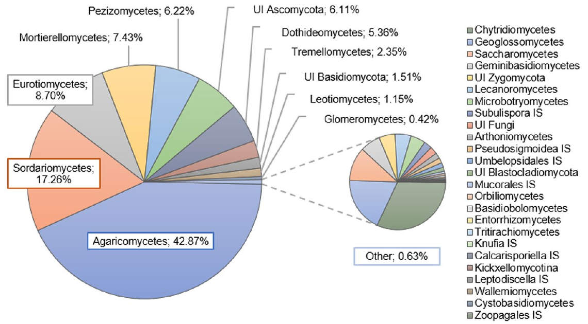
```

### Interesting alternatives

```{r, out.height= "200px", fig.cap="Adam et al 2018"}
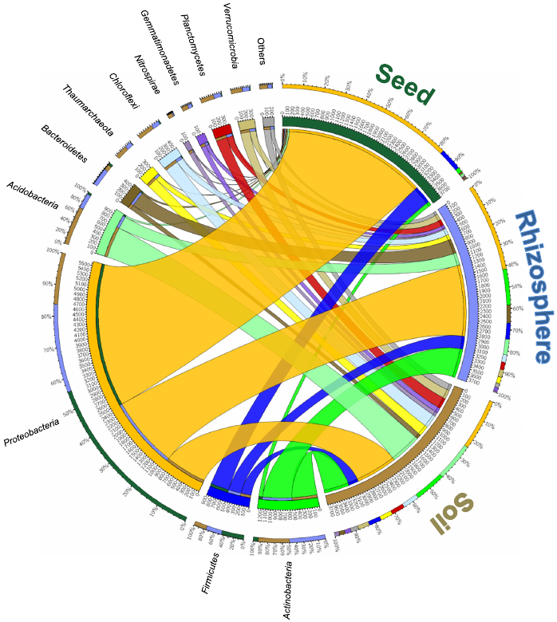
```

### Interesting alternatives

```{r, out.width= "300px", fig.cap="Chen et al 2018"}
sharedbib::add_document('chen2018core')
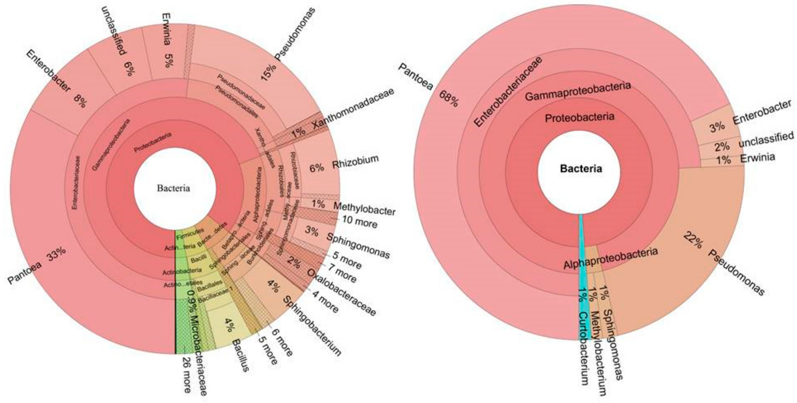
```

### Interesting alternatives

```{r, out.width= "240px", fig.cap="Perez et al 2017"}
sharedbib::add_document('perez2017linking')
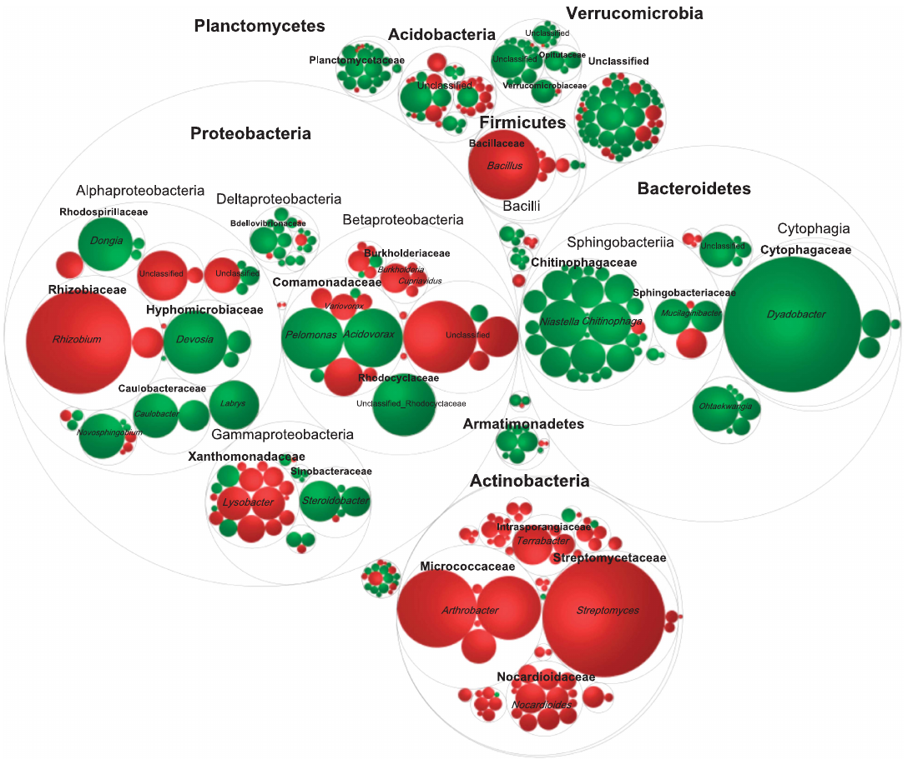
```

### Heat trees

* Used to plot per-taxon information on a taxonomic tree
* The color and size of nodes and edges can each display a different statistic
* They provide more information than stacked barcharts, but cannot display as many samples
* Generated using the R package `metacoder`

```{r, out.width= "300px", fig.cap="Foster et al 2017"}
sharedbib::add_document('foster2017metacoder')
knitr::include_graphics("images/figure_2.png")
```


### .

\section{Differential Abundance}

Bioinformatic analysis techniques for exploring differences in taxon abundance among experimental factors

### Comparing abundances

* The abundance of the same OTU/ASV/Taxon can be compared in multiple Treatments/Hosts/Sites/etc.
* The abundance of different OTUs/ASVs/Taxa usually cannot be compared.
* Absolute abundance is not known for metabarcoding and shotgun metagenomics.
* Differences in relative abundance should not be confused with differences in absolute abundance.

### Difficulties in comparing abundance

* The compositional nature of metabarcoding violates the assumptions of most statistical techniques.
* We will use basic non-parametric methods in this workshop for simplicity, **but this is not the current best practice**.
* The current best methods are borrowed from studies of gene expression data and can be used with the `edgeR`, `DESeq2`, and `metagenomeSeq` R packages. 
* For these methods, it is better to use unnormalized counts [@mcmurdie2014waste].

### Plotting with barcharts

```{r, out.width= "240px", fig.cap="Perez et al 2017"}
sharedbib::add_document('perez2017linking')
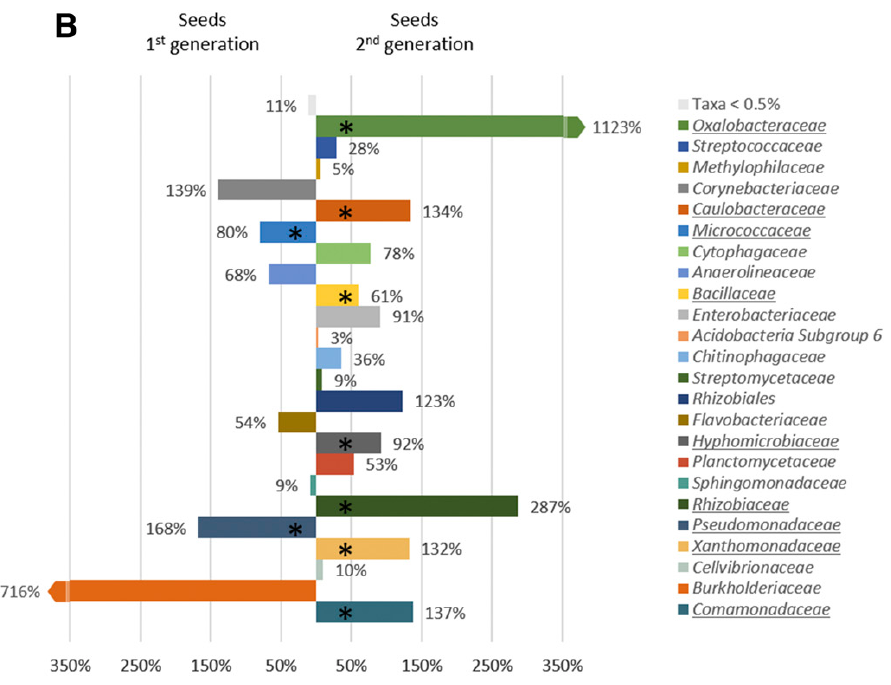
```

### Plotting with box plots

```{r, out.width= "240px", fig.cap="Sapp et al 2019"}
sharedbib::add_document('sapp2019site')
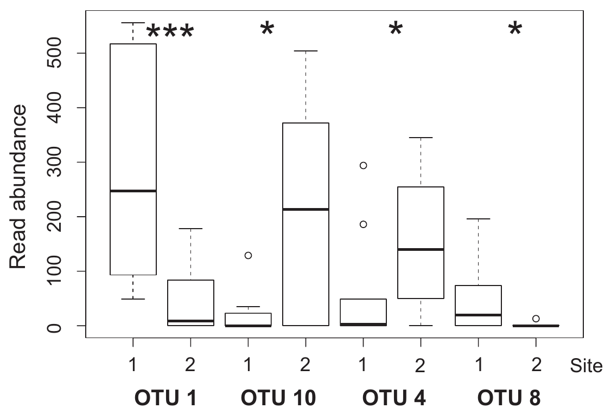
```

### Plotting with heat trees

```{r, out.width= "240px"}
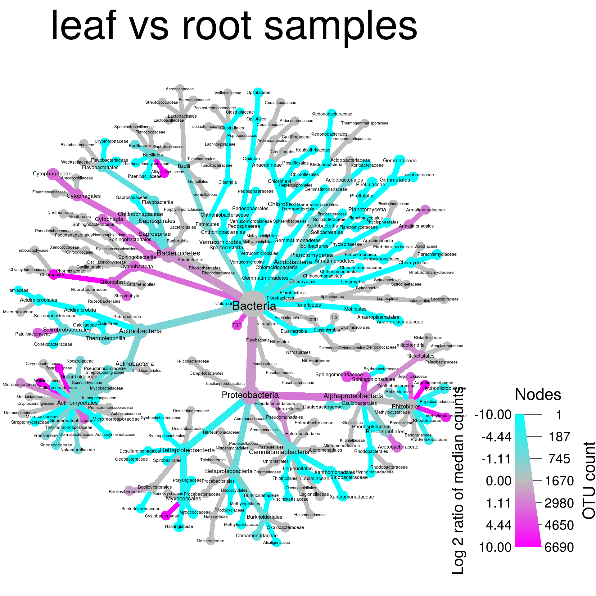
```

### Plotting with a heat tree matrix

```{r, out.width= "220px", fig.cap="Foster et al 2017"}
sharedbib::add_document('foster2017metacoder')
knitr::include_graphics("images/figure_5.png")
```

### .

\section{Alpha diversity}

Bioinformatic analysis techniques for exploring sample diversity


### Alpha diversity: What is being measured?

* Alpha diversity is a measure of the "diversity" of a single sample/community.
* There are many different measures commonly used.
* Some measure take into account relative abundance.
* Some measures take into account phylogenetic relatedness.

```{r, out.width= "300px", fig.cap="Finotello et al 2016"}
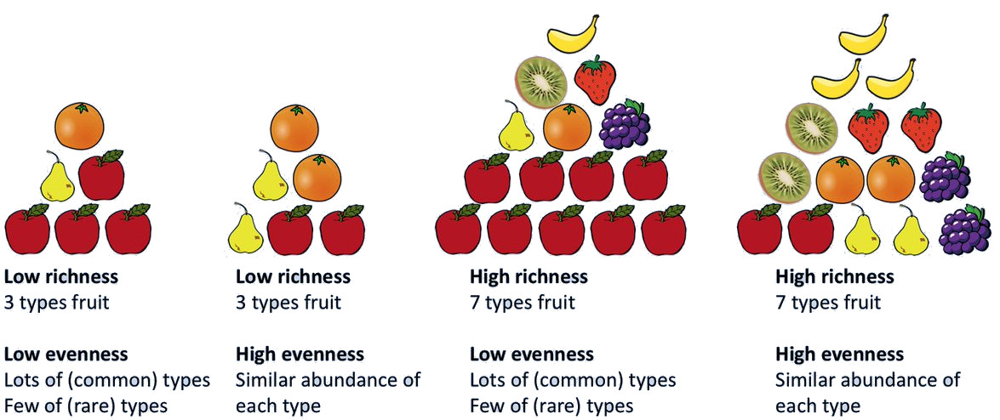
```

### Common measures and Hill numbers

* The commonly used measures Richness, Shannon, Simpson are all transformations of the "Hill numbers" [@morris2014choosing].
* Hill numbers are a related set of diversity measures that differ in the value of a single variable called the "Hill's power".
* The higher the value of the Hill's power, the less sensitive the measure is to rare species.
* There is also a variant of Hill numbers that takes into account phylogenetic/taxonomic relatedness [@chao2010phylogenetic].

```{r, out.width= "200px", fig.cap="Morris et al 2014"}
sharedbib::add_document('morris2014choosing')
sharedbib::add_document('chao2010phylogenetic')
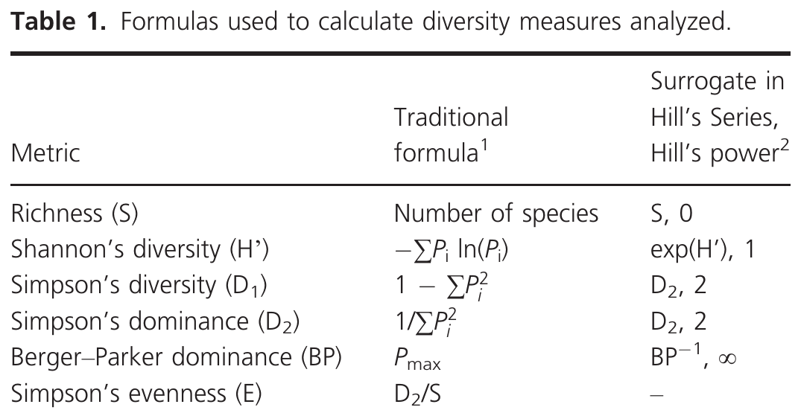
```

### Some examples of each type

```{r, out.width= "330px"}
knitr::include_graphics("images/alpha_diversity_table.png")
```

### How to plot alpha diversity

```{r, out.width= "250px", fig.cap="Lavoie et al 2019"}
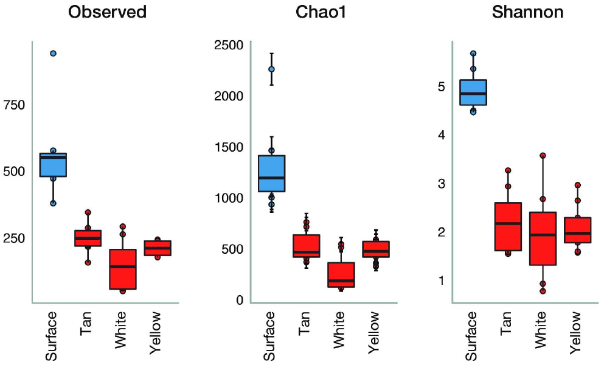
```

### How to plot alpha diversity

```{r, out.width= "250px"}
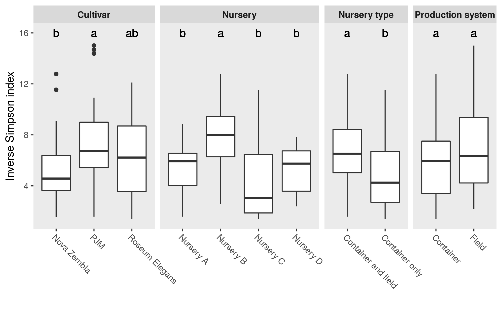
```

### Statistical tests

* What kind of statistics are used to test for differences in alpha diversity depend on if the data meets the assumptions of normality and homogeneity of variance.
* If the Levene test for homogeneity of variance and the Shapiro-Wilk test for normality pass:
   + For two factors: A T-test
   + For more than two factors: An ANOVA followed by Tukey's HSD post-hoc test
* If Levene or Shapiro-Wilk tests do not pass: 
   + For two factors: A Wilcoxon rank sum test
   + For more than two factors: A Kruskal Wallis test followed by Dunn's post-hoc test


### .

\section{Beta diversity}

Bioinformatic analysis techniques for comparing communities


### Beta diversity

* Beta diversity measures the difference in community composition between two samples.
* Some beta diversity measures take into account relative abundance.
* Some beta diversity measures take into account phylogenetic relatedness.
* PERMANOVA can be used to test which experimental factors correlate with differences in community composition.

```{r, out.width= "300px"}
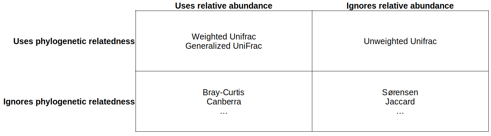
```

### Unifrac

**Unifrac** is the proportion of branch length of a phylogenetic tree that is shared by two communities.

```{r, out.height= "100px", fig.cap="Mothur Wiki"}
knitr::include_graphics("images/UnweightedUniFracMeasure.jpg")
```

**Weighted unifrac** is the same, except the branch lengths are weighted by the relative abundance.

### How the data is stored

Beta diversity is typically stored as a pairwise triangular matrix.

```{r, out.height= "160px", fig.cap="Mahnert 2015"}
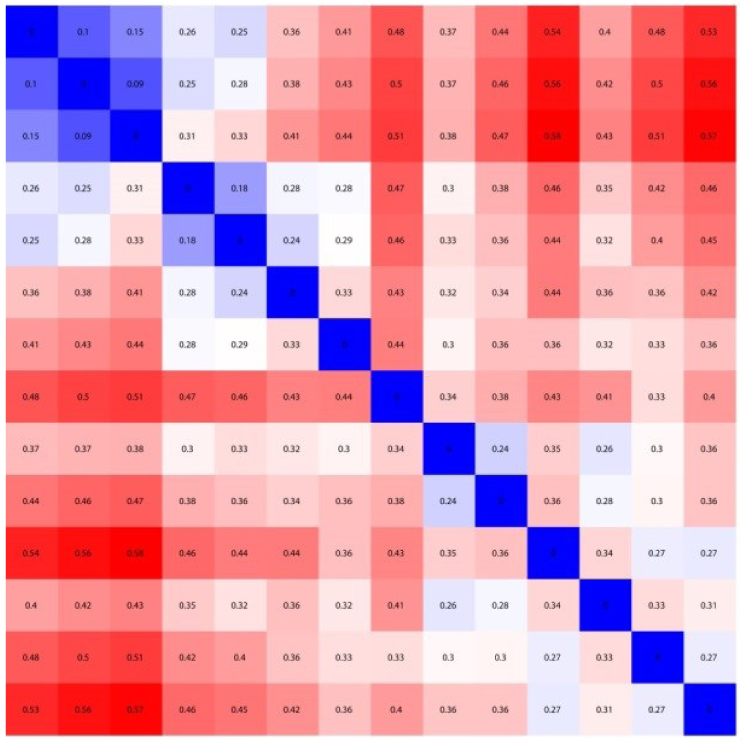
```

### How beta diversity is plotted

Beta diversity is usually plotted using ordination like non-metric multidimensional scaling (**NMDS**) and Principal Coordinates Analysis (**PCoA**).

```{r, out.width= "320px"}
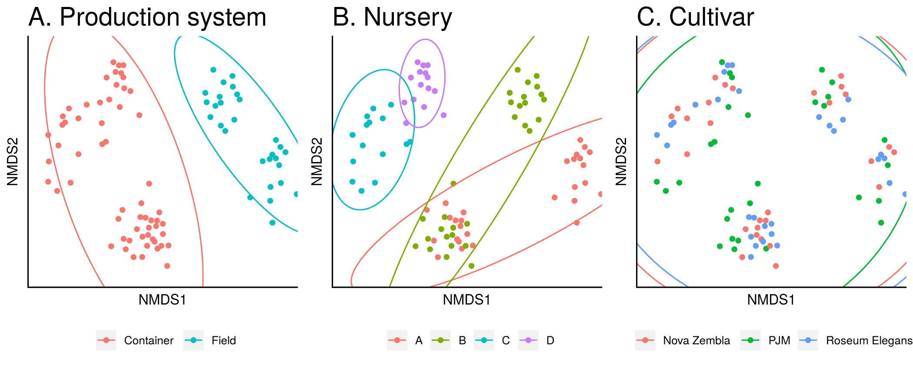
```

### How beta diversity is plotted

```{r, out.height = "220px"}
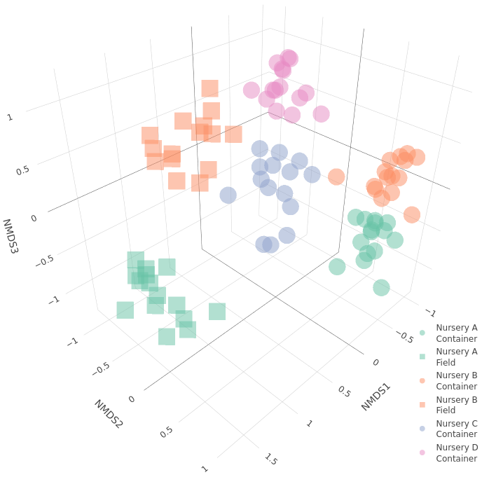
```


### References
