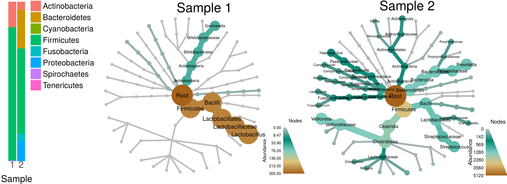
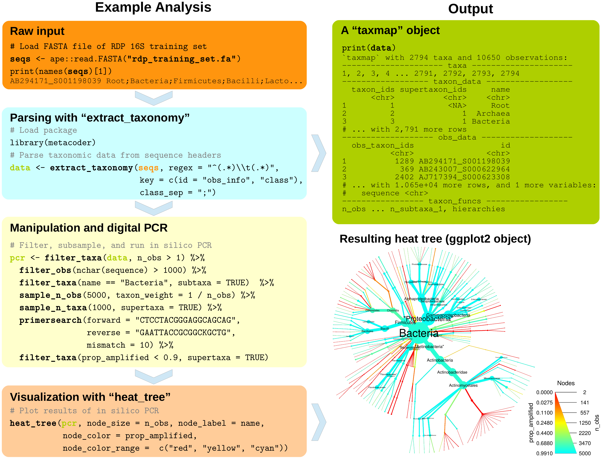

```{r setup, include=FALSE}
knitr::opts_chunk$set(cache = TRUE, autodep = TRUE, mysize = TRUE, size = '\\small', warning = FALSE)
knitr::knit_hooks$set(mysize = function(before, options, envir) {
  if (before) 
    return(options$size)
})
library(magrittr)
library(metacoder)
```

## Introducing MetacodeR

Metabarcoding is revolutionizing microbial ecology and presenting new challenges:

- Numerous formats make taxonomic data difficult to parse
- The hierarchical nature of taxonomic data makes filtering and sampling complicated
- Stacked bar charts lack taxonomic context and are limited by the number of discernible colors.

Metacoder is an R package that attempts to addresses these issues:

- Taxonomic data can be extracted from any file format definable by regular expressions.
- Data can be subset and sampled while taking into account hierarchical relationships.
- Community diversity can be visualized by color and size in a tree-base plot.



## Parsing taxonomic data: Embedded classifications

```{r, echo = FALSE}
rdp_fasta_url <- "https://mothur.org/w/images/b/b5/Trainset10_082014.rdp.tgz"
temp_dir_path <- tempdir()
local_file_path <- file.path(temp_dir_path, basename(rdp_fasta_url))
download.file(url = rdp_fasta_url, destfile = local_file_path, quiet = TRUE, mode="wb")
# Get contents of tar archive
unpacked_file_paths <- untar(local_file_path, list = TRUE)
# Uncompress archive
untar(local_file_path, exdir = temp_dir_path)
# Identify the Mothur RDP training set
input_file_path <- file.path(temp_dir_path, unpacked_file_paths[grepl("fasta$", unpacked_file_paths)])
seqs <- ape::read.FASTA(input_file_path)
```

Embedded classifications often appear in abundance matrices and FASTA headers and are the best source of taxonomic information.

Any extra observation info that should preserved in the parsed data can be added to the `key` option as `"obs_info"`.

The code below parses the Mothur 16s RDP training set.

```{r eval = FALSE}
library(metacoder)

seqs <- ape::read.FASTA("trainset14_032015.rdp.fasta") 
```

```{r, warning = FALSE, message = FALSE}
cat(names(seqs)[1]) 
data <- extract_taxonomy(seqs[1:1000],
                         regex = "^(.*)\\t(.*)", 
                         key = c(rdp_id = "obs_info", "class"),
                         class_sep = ";")
```

## Parsing taxonomic data: Embedded classifications

```{r}
print(data, max_rows = 4)
```


## Parsing taxonomic data: Genbank accession numbers

Genbank accession numbers can be used to look up the NCBI taxonomy for sequences. 

However, this can be quite slow since this information must be queried from NCBI's servers, which are heavily used.

In the code below, the `regex` option can be omitted since only the accession is present. 

```{r, warning = FALSE, message = TRUE, eval = FALSE}
ids <- c("JQ086376.1", "AM946981.2", "JQ182735.1", "CP001396.1", "J02459.1",
         "AC150248.3", "X64334.1", "CP001509.3", "CP006698.1", "AC198536.1",
         "JF340119.2", "KF771025.1", "CP007136.1", "CP007133.1", "U39286.1",
         "CP006584.1", "EU421722.1", "U03462.1", "U03459.1", "AC198467.1",
         "V00638.1", "CP007394.1", "CP007392.1", "HG941718.1", "HG813083.1",
         "HG813082.1", "CP007391.1", "HG813084.1", "CP002516.1", "KF561236.1",
         "JX509734.1", "AP010953.1", "U39285.1", "M15423.1", "X98613.1",
         "CP006784.1", "CP007393.1", "CU928163.2", "AP009240.1", "CP007025.1",
         "CP006027.1", "CP003301.1", "CP003289.1", "CP000946.1", "CP002167.1",
         "HG428755.1", "JQ086370.1", "CP001846.1", "CP001925.1", "X99439.1",
         "AP010958.1", "CP001368.1", "AE014075.1", "CP002212.1", "CP003034.1",
         "CP000243.1", "AY940193.1", "CP004009.1", "JQ182732.1", "U02453.1",
         "AY927771.1", "BA000007.2", "CP003109.1", "CP007390.1", "U02426.1", 
         "U02425.1", "CP006262.1", "HG738867.1", "U00096.3", "FN554766.1",
         "CP001855.1", "L19898.1", "AE005174.2", "FJ188381.1", "AK157373.1",
         "JQ182733.1", "U39284.1", "U37692.1", "AF129072.1", "FM180568.1",
         "CP001969.1", "HE616528.1", "CP002729.1", "JF974339.1", "AB248924.1", 
         "AB248923.1", "CP002291.1", "X98409.1", "CU928161.2", "CP003297.1",
         "FJ797950.1", "CP000038.1", "U82598.1", "CP002211.1", "JQ806764.1",
         "U03463.1", "CP001665.1")
contaminants <- extract_taxonomy(ids,
                                 key = "obs_id",
                                 database = "ncbi")
```

## Parsing taxonomic data: Genbank accession numbers

```{r}
print(contaminants, max_rows = 4)
```

## Parsing taxonomic data: Taxon names

Taxon names can also be used to look up a complete classification.

Which taxon names are valid depend on the database used. 

The code below scrapes taxon names from [The Plant List](http://www.theplantlist.org/1.1/browse/B/).

```{r}
taxon_names <- "http://www.theplantlist.org/1.1/browse/B/" %>%
  XML::htmlTreeParse() %>% 
  XML::xmlRoot() %>%
  XML::getNodeSet("//ul[@id='nametree']/li/a/i") %>%
  sapply(XML::xmlValue)
head(taxon_names)
```

Note that a different database is being used this time: The Integrated Taxonomic Information System.

```{r, warning = FALSE, message = FALSE, eval = FALSE}
bryophytes_ex_data <- extract_taxonomy(taxon_names,
                                       key = "name",
                                       database = "itis")
```


## Parsing taxonomic data: Taxon names

```{r}
print(bryophytes_ex_data, max_rows = 4)
```


## Parsing taxonomic data: Taxon IDs

Finally, the taxon IDs for a particular database can be used to look up the classification.

Any extra **taxon** info that should preserved in the parsed data can be added to the `key` option as `"taxon_info"`.

The code below uses NCBI taxon IDs embedded in FASTA headers.

```{r}
file_path <- system.file("extdata", "its1_chytridiomycota_hmm.fasta",
                         package = "metacoder")
sequences <- ape::read.FASTA(file_path)
cat(names(sequences)[1])
```

```{r, warning = FALSE, message = FALSE, eval = FALSE}
its1_ex_data <- extract_taxonomy(sequences,
                                 regex = "^.*\\|(.*)\\|tax_id:(.*)\\|(.*)$",
                                 key = c(taxon_name = "taxon_info",
                                         "taxon_id", description = "obs_info"),
                                 database = "ncbi")
```

## Parsing taxonomic data: Taxon IDs

```{r}
print(its1_ex_data, max_rows = 4)
```


## Plotting taxonomic data: Heat trees

Parsed data can be plotted using the `heat_tree` function.

Any statistic can be mapped to the size and color of nodes and edges.

```{r fig.width=3}
heat_tree(data, node_size = n_obs, node_label = name, node_color = n_obs)
```


## Plotting taxonomic data: Overlap optimization

The size range of nodes is optimized for each graph by default to avoid overlaps while maximizing size range.

The balance between the two goals can be modified with the `overlap_avoidance` option.

```{r, eval=FALSE}
heat_tree(data, node_size = n_obs, overlap_avoidance = 10, title = "10")

heat_tree(data, node_size = n_obs, overlap_avoidance = 0.1, title = "0.1")
```


```{r, echo=FALSE}
gridExtra::grid.arrange(ncol = 2, nrow = 1, widths = c(1, 1.1),
                        heat_tree(data, node_size = n_obs, overlap_avoidance = 10, title = "10"),
                        heat_tree(data, node_size = n_obs, overlap_avoidance = 0.1, title = "0.1"))
```


## Plotting taxonomic data: Size

The size range of nodes and edges can also be specified manually.

```{r eval = FALSE}
heat_tree(data, node_size = - n_supertaxa, node_size_range = c(0.001, 0.03),
          edge_size_range = c(0.001, 0.001))

heat_tree(data, edge_size = - n_supertaxa, edge_size_range = c(0.0001, 0.01),
          node_size_range = c(0.005, 0.005))
```

```{r echo = FALSE}
gridExtra::grid.arrange(ncol = 2, nrow = 1, widths = c(1.1, 1),
                        heat_tree(data, node_size = - n_supertaxa, node_size_range = c(0.001, 0.03),
                                  edge_size_range = c(0.001, 0.001)),
                        heat_tree(data, edge_size = - n_supertaxa, edge_size_range = c(0.0001, 0.01),
                                  node_size_range = c(0.005, 0.005)))
```


## Plotting taxonomic data: Color

Mapping statistics to color works like it does for size.

A custom color range can be specified with `node_color_range` and `edge_color_range`.

```{r eval = FALSE}
heat_tree(data, node_size = n_obs, node_color = n_obs,
          node_color_range = c("#FFFFFF", "darkorange3", "#4e567d"))

heat_tree(data, node_size = n_obs, node_color = "grey",
          edge_color = n_obs)
```


```{r echo= FALSE}
gridExtra::grid.arrange(ncol = 2, nrow = 1,
                        heat_tree(data, node_size = n_obs, node_color = n_obs,
                                  node_color_range = c("#FFFFFF", "darkorange3", "#4e567d")),
                        heat_tree(data, node_size = n_obs, node_color = "grey",
                                  edge_color = n_obs))
```


## Plotting taxonomic data: Labels

Labels can be added to nodes and edges.

Unlike most graphing in R, label sizes relative to other graph elements do not change with output size or aspect ratio.

```{r eval = FALSE}
heat_tree(data, node_size = n_obs, node_label = name,
          node_label_max = 200, title = "Node labels")

heat_tree(data, node_size = n_obs, edge_label = name,
          edge_label_max = 200, title = "Edge labels")
```


```{r echo = FALSE}
gridExtra::grid.arrange(ncol = 2, nrow = 1,
                        heat_tree(data, node_size = n_obs, node_label = name,
                                  node_label_max = 200, title = "Node labels"),
                        heat_tree(data, node_size = n_obs, edge_label = name,
                                  edge_label_max = 200, title = "Edge labels"))
```


## Plotting taxonomic data: Layouts

Different layouts are available that suit different data structures.

For stochastic, simulated layouts like "davidson-harel", it can sometimes be useful to initialize with another layout.

```{r eval = FALSE}
set.seed(2)
heat_tree(data, node_size = n_obs, node_label = name,
          layout = "davidson-harel")

heat_tree(data, node_size = n_obs, node_label = name,
          layout = "davidson-harel", initial_layout = "reingold")
```


```{r echo = FALSE}
set.seed(2)
gridExtra::grid.arrange(ncol = 2, nrow = 1,
                        heat_tree(data, node_size = n_obs, node_label = name,
                                  layout = "davidson-harel"),
                        heat_tree(data, node_size = n_obs, node_label = name,
                                  layout = "davidson-harel", initial_layout = "reingold"))
```


## Plotting taxonomic data: Multiple roots

When there are multiple roots to the taxonomy, multiple trees will be made an arranged in the same plot.

Each tree can be given a title with the `tree_label` option.

```{r fig.width=3.5}
set.seed(3)
heat_tree(contaminants, node_size = n_obs, node_color = n_obs, node_label = name,
          tree_label = name, layout = "fruchterman-reingold")
```

## Subsetting taxonomic data: Default behavior

Modifying data is done using functions analogous to `dplyr`'s functions for data frames.

Filtering taxa can be done using `filter_taxa` with one or more filtering conditions. 

The code below filters out all taxa with less than 3 observations.

```{r eval = FALSE}
data %>%
  heat_tree(node_size = n_obs, node_label = name, node_color = n_obs)

filter_taxa(data, n_obs >= 3) %>%
  heat_tree(node_size = n_obs, node_label = name, node_color = n_obs)
```

```{r echo = FALSE}
set.seed(1)
gridExtra::grid.arrange(ncol = 2, nrow = 1,
                        heat_tree(data,
                                  node_size = n_obs, node_label = name,
                                  node_color = n_obs),
                        heat_tree(filter_taxa(data, n_obs >= 3),
                                  node_size = n_obs, node_label = name,
                                  node_color = n_obs))
```


## Subsetting taxonomic data: Including subtaxa

The subtaxa of taxa passing the filter can be included as well using the `subtaxa` option.

The code below subsets the data for "Firmicutes" and "Bacilli" and their subtaxa.

```{r eval = FALSE}
filter_taxa(data, name == "Firmicutes", subtaxa = TRUE) %>%
  heat_tree(node_size = n_obs, node_label = name, node_color = n_obs)

filter_taxa(data, name == "Bacilli", subtaxa = TRUE) %>%
  heat_tree(node_size = n_obs, node_label = name, node_color = n_obs)
```

```{r echo = FALSE}
gridExtra::grid.arrange(ncol = 2, nrow = 1,
                        heat_tree(filter_taxa(data, name == "Firmicutes", subtaxa = TRUE),
                                  node_size = n_obs, node_label = name,
                                  node_color = n_obs),
                        heat_tree(filter_taxa(data, name == "Bacilli", subtaxa = TRUE),
                                  node_size = n_obs, node_label = name,
                                  node_color = n_obs))
```


## Subsetting taxonomic data: Including supertaxa

The `supertaxon` option works similar to the `subtaxa` option. 

The code below does the same subset as last slide, but includes the supertaxa as well. 

```{r eval = FALSE}
filter_taxa(data, name == "Firmicutes", subtaxa = TRUE, supertaxa = TRUE) %>%
  heat_tree(node_size = n_obs, node_label = name, node_color = n_obs)

filter_taxa(data, name == "Bacilli", subtaxa = TRUE, supertaxa = TRUE) %>%
  heat_tree(node_size = n_obs, node_label = name, node_color = n_obs)
```


```{r echo = FALSE}
gridExtra::grid.arrange(ncol = 2, nrow = 1,
                        heat_tree(filter_taxa(data, name == "Firmicutes", subtaxa = TRUE, supertaxa = TRUE),
                                  node_size = n_obs, node_label = name,
                                  node_color = n_obs),
                        heat_tree(filter_taxa(data, name == "Bacilli", subtaxa = TRUE, supertaxa = TRUE),
                                  node_size = n_obs, node_label = name,
                                  node_color = n_obs))
```

## Subsetting taxonomic data: Removing internal taxa 

By default, when internal taxa are removed their subtaxa are reassigned to any supertaxon that passed the filter.

Not doing this is possible with the `reassign_taxa` option, but usually makes a mess. 

The code below removes the taxa in red with and without reassigning taxa. 

```{r eval = FALSE}
data %>%
  heat_tree(node_size = n_obs, node_label = name, 
            node_color = ifelse(n_supertaxa == 2, "red", "grey"), make_legend = FALSE)

filter_taxa(data, n_supertaxa != 2) %>%
  heat_tree(node_size = n_obs, node_label = name, node_color = n_obs)

filter_taxa(data, n_supertaxa != 2, reassign_taxa = FALSE) %>%
  heat_tree(node_size = n_obs, node_label = name, node_color = n_obs, tree_label = name)
```


```{r echo = FALSE}
set.seed(2)
gridExtra::grid.arrange(ncol = 3, nrow = 1, widths = c(.8, 1, 1.1),
                        heat_tree(data,
                                  node_size = n_obs, node_label = name,
                                  node_color = ifelse(n_supertaxa == 2, "red", "grey"), make_legend = FALSE),
                        heat_tree(filter_taxa(data, n_supertaxa != 2),
                                  node_size = n_obs, node_label = name,
                                  node_color = n_obs),
                        heat_tree(filter_taxa(data, n_supertaxa != 2, reassign_taxa = FALSE),
                                  node_size = n_obs, node_label = name,
                                  node_color = n_obs, tree_label = name))
```


## Sampling taxa

Random sampling of taxa works in a similar way to filtering taxa. 

All of the options for `filter_taxa`, such as `subtaxa` and `reassign_taxa`, are available to `sample_n_taxa`. 

```{r, eval=FALSE}
set.seed(1)

sample_n_taxa(data, 20, supertaxa = TRUE) %>%
  heat_tree(node_size = n_obs, node_label = name, node_color = n_obs)

sample_n_taxa(data, 40, supertaxa = TRUE) %>%
  heat_tree(node_size = n_obs, node_label = name, node_color = n_obs)
```


```{r echo = FALSE}
set.seed(1)
gridExtra::grid.arrange(ncol = 2, nrow = 1,
                        heat_tree(sample_n_taxa(data, 20, supertaxa = TRUE),
                                  node_size = n_obs, node_label = name,
                                  node_color = n_obs),
                        heat_tree(sample_n_taxa(data, 40, supertaxa = TRUE),
                                  node_size = n_obs, node_label = name,
                                  node_color = n_obs))
```

## Sampling observations

Observations assigned to taxa can also be filtered and sampled. 

The code below randomly selects 50 (without replacement) and 100,000 (with replacement) observations. 

```{r, eval=FALSE}
sample_n_obs(data, 50) %>%
  heat_tree(node_size = n_obs, node_label = name, node_color = n_obs)

sample_n_obs(data, 100000, replace = TRUE) %>%
  heat_tree(node_size = n_obs, node_label = name, node_color = n_obs)
```

```{r echo = FALSE}
set.seed(1)
gridExtra::grid.arrange(ncol = 2, nrow = 1,
                        heat_tree(sample_n_obs(data, 50), node_size = n_obs, node_label = name, node_color = n_obs),
                        heat_tree(sample_n_obs(data, 100000, replace = TRUE), node_size = n_obs, node_label = name, node_color = n_obs))
```

## Example workflow: In silico PCR 



## Example Application: The Human Microbiome project

Pairwise comparisons of microbiome communities in different parts of the human body.
Only significant differences in abundance are colored. 


## Plans for future development

Metacoder is under active development and many new features are planned.
Some improvements that are being worked on include:

* Plotting functions for pairwise comparison of treatments
* Barcoding gap analysis and associated plotting functions
* A function to aid in retrieving appropriate sequence data from NCBI for *in silico* PCR from whole genome sequences.
* The `taxmap` class and manipulation functions are being made into an ropensci package called [taxa](https://github.com/ropenscilabs/taxa) with significant upgrades

To see the details of what is being worked on, check out the [issues](https://github.com/grunwaldlab/metacoder/issues) tab of the metacoder [Github site](https://github.com/grunwaldlab).


